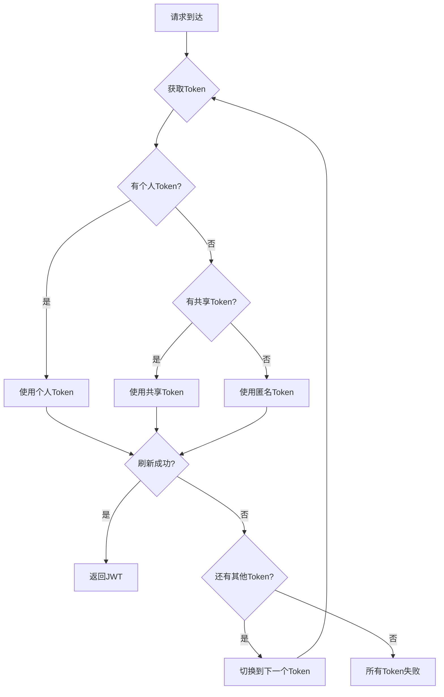

# 多Token配置指南

## 📖 概述

Warp2Api 现在支持配置多个refresh token，实现智能负载均衡和自动故障转移。这个功能特别适合：

- 👤 **个人用户**：配置多个账号的token，轮换使用避免单个账号过载
- 👥 **团队使用**：配置团队成员的tokens，实现负载分担
- 🏢 **企业部署**：配置多层级tokens，确保高可用性

## 🎯 核心特性

### 1. 三级优先级策略

系统按以下优先级自动选择token：

```
优先级 1: 个人Token (PERSONAL)
    ↓ 失败时
优先级 2: 共享Token (SHARED)
    ↓ 失败时
优先级 3: 匿名Token (ANONYMOUS)
```

### 2. 智能轮换机制

- **同优先级轮询**：同一优先级的多个tokens采用round-robin轮换
- **自动故障转移**：token失败时自动切换到下一个可用token
- **失败计数**：每个token最多允许3次失败
- **自动禁用**：失败3次后自动禁用该token
- **健康恢复**：支持手动或自动恢复失败的token

### 3. 实时监控

- 📊 Token池状态监控
- 🏥 健康检查功能
- 📈 使用统计信息
- ⚠️ 失败告警

## 🚀 快速开始

### 方案1: 单个个人Token（最简单）

适合只有一个账号的个人用户。

```env
# .env
WARP_REFRESH_TOKEN=your_personal_refresh_token_here
```

系统会自动使用内置匿名token作为后备。

### 方案2: 多个个人Tokens（推荐）

适合有多个账号的用户，可以轮换使用。

```env
# .env
# 方式1: 使用 WARP_REFRESH_TOKEN（单个）
WARP_REFRESH_TOKEN=token_1

# 方式2: 使用 WARP_PERSONAL_TOKENS（多个，逗号分隔）
WARP_PERSONAL_TOKENS=token_2,token_3,token_4

# 两种方式可以同时使用，系统会合并所有个人tokens
```

### 方案3: 完整配置（最佳实践）

适合团队使用，提供最高的可用性。

```env
# .env
# 个人tokens（最高优先级）
WARP_REFRESH_TOKEN=my_personal_token
WARP_PERSONAL_TOKENS=personal_token_2,personal_token_3

# 共享tokens（中等优先级）
WARP_SHARED_TOKENS=team_shared_1,team_shared_2,team_shared_3

# 匿名token（最低优先级，可选）
WARP_ANONYMOUS_TOKEN=anonymous_fallback
```

## 📝 配置示例

### 个人使用（2个账号）

```env
WARP_REFRESH_TOKEN=AMf-vBxSRmdh_account1
WARP_PERSONAL_TOKENS=AMf-vBxSRmdh_account2
```

**效果**：
- 2个个人tokens轮换使用
- 内置匿名token作为后备
- 总共3个tokens可用

### 小团队（5人）

```env
WARP_PERSONAL_TOKENS=token_alice,token_bob,token_charlie,token_david,token_eve
```

**效果**：
- 5个团队成员的tokens轮换使用
- 自动负载均衡
- 单个token失败不影响服务

### 大团队（高可用）

```env
# 核心成员的个人tokens
WARP_PERSONAL_TOKENS=token_admin1,token_admin2,token_admin3

# 团队共享tokens
WARP_SHARED_TOKENS=token_team1,token_team2,token_team3,token_team4

# 匿名后备
WARP_ANONYMOUS_TOKEN=token_anonymous
```

**效果**：
- 3个个人tokens优先使用
- 4个共享tokens作为备用
- 1个匿名token作为最后后备
- 总共8个tokens，高可用性

## 🔍 工作原理

### Token选择流程



### 失败处理流程

```
Token失败
    ↓
失败计数 +1
    ↓
失败次数 < 3? ──是──→ 标记失败，继续可用
    ↓
    否
    ↓
禁用该Token
    ↓
切换到下一个可用Token
```

## 🛠️ 管理和监控

### 查看Token池状态

启动服务时，日志会显示token池的初始化信息：

```
2025-10-31 14:52:19 - INFO - 🔄 Initializing token pool...
2025-10-31 14:52:19 - INFO - ✅ Loaded personal token from WARP_REFRESH_TOKEN
2025-10-31 14:52:19 - INFO - ✅ Loaded 3 personal tokens from WARP_PERSONAL_TOKENS
2025-10-31 14:52:19 - INFO - ✅ Loaded 2 shared tokens from WARP_SHARED_TOKENS
2025-10-31 14:52:19 - INFO - 📊 Token Pool: 6/6 active tokens (PERSONAL: 4, SHARED: 2)
```

### 运行测试

验证配置是否正确：

```bash
uv run python test_token_pool.py
```

测试会验证：
- ✅ Token池初始化
- ✅ 优先级选择
- ✅ 轮换机制
- ✅ Token刷新
- ✅ 健康检查
- ✅ 失败处理和恢复

### 健康检查

在运行时检查token健康状态（可以通过API或日志）：

```python
from warp2protobuf.core.auth import check_token_pool_health

# 异步调用
health = await check_token_pool_health()
```

输出示例：
```
=== Token Pool Health Check ===
Healthy tokens: 5/6
Unhealthy tokens: 1
✅ PERSONAL_1234 (PERSONAL): failures=0, active=True
✅ PERSONAL_5678 (PERSONAL): failures=0, active=True
❌ SHARED_9012 (SHARED): failures=3, active=False
```

## 📊 最佳实践

### 1. Token数量建议

| 使用场景 | 个人Token | 共享Token | 总计 |
|---------|----------|----------|------|
| 个人使用 | 1-2 | 0 | 1-2 |
| 小团队 | 2-5 | 0-2 | 2-7 |
| 中型团队 | 3-5 | 3-5 | 6-10 |
| 大型团队 | 5-10 | 5-10 | 10-20 |

### 2. 配置建议

- ✅ **优先使用个人tokens**：确保个人账号的token优先被使用
- ✅ **配置多个tokens**：至少配置2-3个tokens以实现负载均衡
- ✅ **分层配置**：个人 + 共享 + 匿名，提供多层保障
- ✅ **定期检查**：定期检查token健康状态，及时更换失效token
- ⚠️ **避免过多tokens**：过多tokens会增加管理复杂度

### 3. 安全建议

- 🔒 不要在代码中硬编码tokens
- 🔒 使用 `.env` 文件存储tokens
- 🔒 不要将 `.env` 文件提交到版本控制
- 🔒 定期轮换tokens
- 🔒 限制token的访问权限

## 🐛 故障排除

### 问题1: 所有tokens都失败

**症状**：
```
❌ All tokens failed to refresh JWT
```

**解决方案**：
1. 检查网络连接
2. 验证tokens是否有效
3. 检查是否被Warp服务限流
4. 尝试恢复失败的tokens

### 问题2: Token被频繁禁用

**症状**：
```
⚠️ Token deactivated after 3 failures: PERSONAL_1234
```

**解决方案**：
1. 检查该token是否已过期
2. 验证token格式是否正确
3. 检查网络稳定性
4. 考虑更换该token

### 问题3: 只使用匿名token

**症状**：
```
🎯 Selected token: ANONYMOUS_2484 (priority: ANONYMOUS)
```

**解决方案**：
1. 检查是否配置了个人或共享tokens
2. 验证 `.env` 文件是否正确加载
3. 检查环境变量是否设置正确

## 📚 API参考

### 环境变量

| 变量名 | 类型 | 说明 | 示例 |
|-------|------|------|------|
| `WARP_REFRESH_TOKEN` | string | 单个个人token | `AMf-vBxSRmdh...` |
| `WARP_PERSONAL_TOKENS` | string | 多个个人tokens（逗号分隔） | `token1,token2,token3` |
| `WARP_SHARED_TOKENS` | string | 共享tokens（逗号分隔） | `shared1,shared2` |
| `WARP_ANONYMOUS_TOKEN` | string | 匿名token | `anonymous_token` |

### Python API

```python
from warp2protobuf.core.token_pool import get_token_pool
from warp2protobuf.core.auth import (
    refresh_jwt_token,
    print_token_pool_info,
    check_token_pool_health,
    recover_failed_tokens
)

# 获取token池
pool = await get_token_pool()

# 刷新JWT
token_data = await refresh_jwt_token()

# 查看池信息
await print_token_pool_info()

# 健康检查
health = await check_token_pool_health()

# 恢复失败的tokens
recovered = await recover_failed_tokens()
```

## 🎓 总结

多Token配置功能为Warp2Api提供了：

- ✅ **高可用性**：多个tokens确保服务持续可用
- ✅ **负载均衡**：自动轮换tokens，避免单点过载
- ✅ **故障转移**：自动切换失败的tokens
- ✅ **优先级控制**：个人tokens优先使用
- ✅ **易于管理**：简单的环境变量配置

开始使用多Token配置，让你的Warp2Api服务更加稳定可靠！

